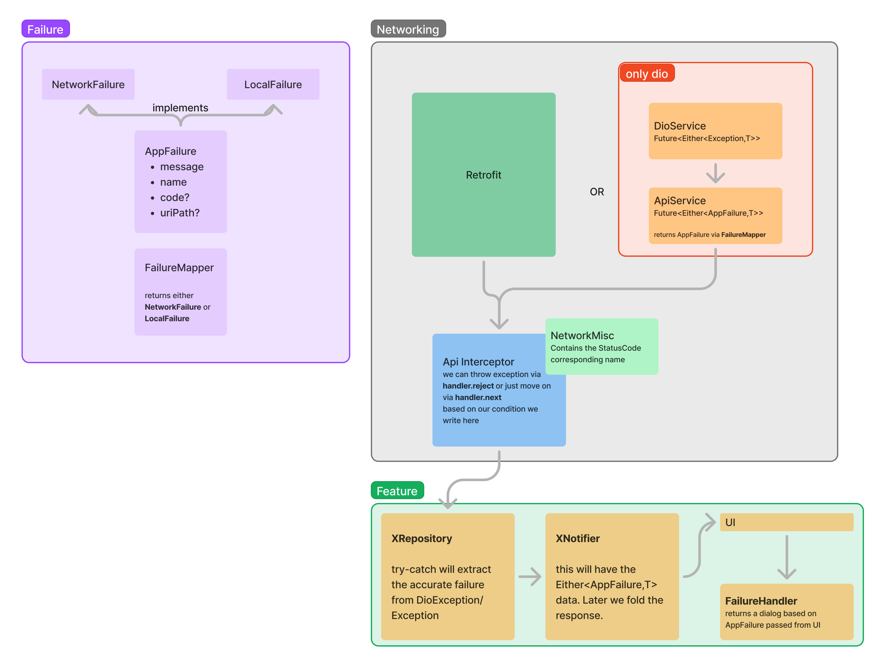
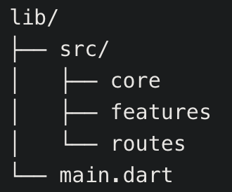
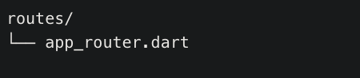
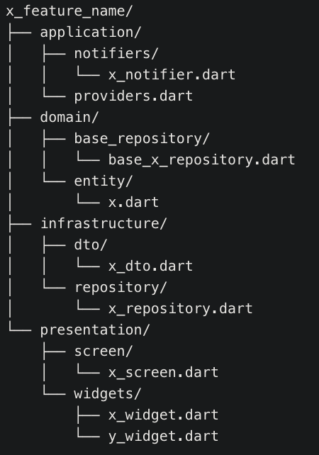
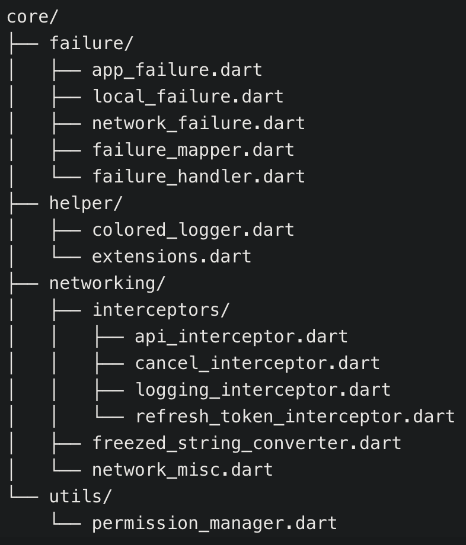
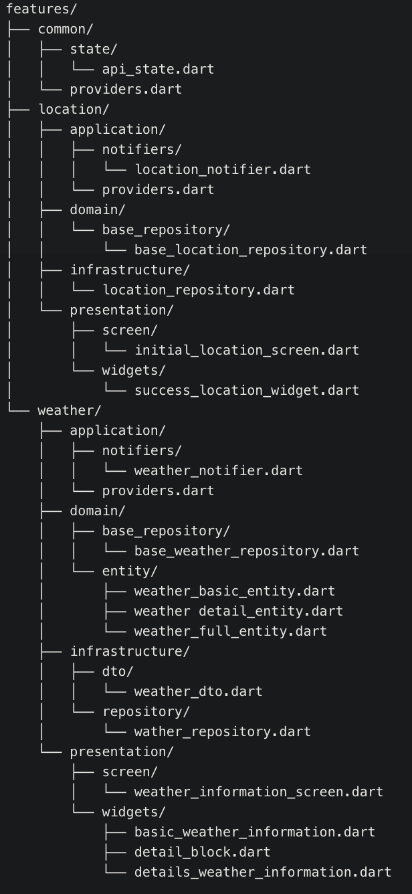

# Study of Network Flow

Figma design of flow chart - https://www.figma.com/board/oyPZGn7pFEZciS5zQR3bzv/Untitled?node-id=0-1&t=hCvKgekUWtBBRIiK-1

### **Overall Network Data Flow in Your Flutter App**

1. **UI Layer Initiates a Request**:
   - The user interacts with the app, triggering an action that requires data from the network (e.g., fetching weather information for a city).
   - This action is captured in the **Presentation Layer**, specifically in the UI widgets or screens.

2. **State Notifier Handles the Request**:
   - The UI calls a method in the **Notifier** (e.g., `getWeather` in `WeatherNotifier`).
   - The notifier is part of the **Application Layer** and is responsible for managing state and business logic.
   - It updates the state to a loading state to reflect that a network request is in progress.

3. **Notifier Interacts with the Repository**:
   - The notifier calls the appropriate method in the **Repository** (e.g., `getWeather` in `WeatherRepositoryImpl`).
   - This call goes through the **Domain Layer**, which defines the abstract `WeatherRepository` interface. The notifier depends on this abstraction, not on the concrete implementation.

4. **Repository Makes Network Call via NetworkApiService**:
   - The repository uses the **NetworkApiService** (Retrofit interface) to make the actual network call.
   - It constructs the request with necessary parameters (city name, API key, units).

5. **Dio and Interceptors Process the Request**:
   - The **Dio** HTTP client sends the request.
   - The **ApiInterceptor** intercepts the request to:
     - Log request details (URL, headers, method).
     - Add or modify headers if needed (e.g., authentication tokens).
   - When the response comes back, the interceptor:
     - Logs response details.
     - Checks for HTTP error codes (e.g., 4xx or 5xx) and converts them into exceptions using `handler.reject`.

6. **Handling Responses and Errors in Repository**:
   - The repository receives the response or catches an exception.
   - In the `try` block:
     - If the response is successful, it logs the response and returns a `Right(response)` wrapped in an `Either` type, indicating success.
   - In the `catch` block:
     - If an exception occurs, it uses `FailureMapper.getFailures(e)` to convert the exception into a well-defined `AppFailure`.
     - Returns a `Left(failure)` indicating an error.

7. **Notifier Updates State Based on Repository Result**:
   - The notifier receives the `Either<AppFailure, WeatherDTO>` result from the repository.
   - It uses pattern matching (`fold`) to handle both cases:
     - On **Success** (`Right`):
       - Converts the `WeatherDTO` into a domain entity (`WeatherFullEntity`) using a factory constructor or mapper.
       - Updates the state to `ApiRequestState.data(data: weatherEntity)`.
     - On **Failure** (`Left`):
       - Updates the state to `ApiRequestState.failed(reason: failure)`.
       - Logs the failure for debugging purposes.

8. **UI Reacts to State Changes**:
   - The UI listens to changes in the notifier's state using Riverpod's `ref.watch`.
   - Depending on the state:
     - **Loading**: Shows a loading indicator.
     - **Data**: Displays the weather information to the user.
     - **Failed**: Shows an error message, possibly with options to retry.

9. **Error Handling and User Feedback**:
   - When a failure occurs, the UI can use the `FailureHandler` to display error dialogs or messages.
   - The error messages are user-friendly and can be specific based on the type of failure (network error, server error, etc.).

### **Understanding Each Layer's Responsibility**

- **Presentation Layer**:
  - Handles UI components and user interactions.
  - Should be free of business logic and data-fetching code.
  - Reacts to state changes provided by the notifier.

- **Application Layer (Notifiers and Providers)**:
  - Manages state and contains business logic related to state changes.
  - Interacts with the domain layer to perform actions like fetching data.
  - Updates the state based on the result of these actions.

- **Domain Layer (Repositories and Entities)**:
  - Defines the core business logic and models (entities).
  - Contains abstract repositories that define what operations are available.
  - Entities are pure Dart objects representing the data in your app.

- **Infrastructure Layer (Data Access and DTOs)**:
  - Implements the repositories defined in the domain layer.
  - Handles data fetching from external sources (APIs, databases).
  - Converts data transfer objects (DTOs) into domain entities.

- **Core Layer**:
  - Contains shared utilities, such as error handling, logging, and networking setup.
  - Provides consistent mechanisms for dealing with failures and logging throughout the app.

### **Applying SOLID Principles**

- **Single Responsibility Principle (SRP)**:
  - Each class and module has one responsibility.
  - For example, `WeatherRepositoryImpl` is only responsible for fetching weather data.

- **Open-Closed Principle (OCP)**:
  - Classes are open for extension but closed for modification.
  - New features can be added without changing existing code, reducing the risk of introducing bugs.

- **Liskov Substitution Principle (LSP)**:
  - Subclasses or implementations should be substitutable for their base types.
  - `WeatherRepositoryImpl` can be used anywhere `WeatherRepository` is expected.

- **Interface Segregation Principle (ISP)**:
  - Clients should not be forced to depend on interfaces they do not use.
  - By defining specific interfaces for repositories, notifiers depend only on what they need.

- **Dependency Inversion Principle (DIP)**:
  - High-level modules should not depend on low-level modules; both should depend on abstractions.
  - The notifier depends on the abstract `WeatherRepository` interface, not the concrete implementation.

### **Benefits of This Approach**

- **Maintainability**:
  - Clear separation of concerns makes the code easier to understand and maintain.
  - Changes in one layer have minimal impact on others.

- **Testability**:
  - Each component can be tested in isolation.
  - Mock implementations can be provided for repositories during testing.

- **Scalability**:
  - The app can grow in features without becoming unmanageable.
  - New features can follow the same structural patterns.

- **Reusability**:
  - Common utilities and patterns in the core layer can be reused across different features.

### **Real-Life Example: Fetching Weather Data**

Let's walk through a real-life example using your app:

1. **User Action**:
   - The user enters a city name and taps a button to fetch the weather.

2. **UI Calls Notifier**:
   - The UI calls `getWeather(cityName)` on the `WeatherNotifier`.

3. **Notifier Updates State to Loading**:
   - The `WeatherNotifier` sets the state to `ApiRequestState.loading()` to show a loading indicator.

4. **Notifier Requests Data from Repository**:
   - The notifier calls `getWeather(cityName)` on the `WeatherRepositoryImpl`.

5. **Repository Fetches Data from API**:
   - The repository uses `NetworkApiService` to make an API call via Retrofit and Dio.

6. **ApiInterceptor Processes Request**:
   - The `ApiInterceptor` logs the request and adds any necessary headers.

7. **Response Handling**:
   - On receiving the response:
     - If successful, the data is returned to the repository.
     - If there's an error (e.g., 404 Not Found), the interceptor rejects the request, and an exception is thrown.

8. **Repository Handles Exceptions**:
   - The repository catches exceptions and uses `FailureMapper` to convert them into `AppFailure` instances.

9. **Notifier Updates State Based on Result**:
   - If data is received, the notifier updates the state to `ApiRequestState.data()` with the weather entity.
   - If an error occurs, the notifier updates the state to `ApiRequestState.failed()` with the failure reason.

10. **UI Reacts to State Change**:
    - The UI observes the notifier's state and updates accordingly:
      - Displays weather information on success.
      - Shows an error message on failure.

### **Conclusion**

Your app's architecture effectively separates concerns, handles errors gracefully, and ensures that network data flows smoothly from the API to the UI. By adhering to clean architecture principles and SOLID design patterns, you've created a scalable and maintainable app structure that can be easily understood and extended by developers at any level.

---

**Next Steps or Further Assistance**

- **Documentation**: Consider adding comments and documentation throughout your code to help new developers understand each component's role.
- **Testing**: Implement unit tests for your notifiers, repositories, and other critical components to ensure reliability.
- **Error Messages**: Enhance user-facing error messages to be more descriptive and helpful.

If you have any specific questions or need clarification on any part of this flow or architecture, feel free to ask!

# Architecture

| Images                         |
|--------------------------------|
|     *Figure 1: Architecture Overview*    |
|          *Figure 2: Router*                      |
|          *Figure 3: single feature structure*                      |
|          *Figure 4: Core structure*                      |
|          *Figure 5: Full app feature folder structure*                      |

# UI 
<table>
  <tr>
    <td>Landing Page</td>
     <td>Landing Page Tap to see more</td>
     <td>Search by city</td>
  </tr>
  <tr>
    <td></td>
    <td></td>
    <td></td>
  </tr>
    <tr>
    <td>Search Result 1</td>
     <td>Search Result 2</td>
      <td></td>
  </tr>
  <tr>
    <td></td>
    <td></td>
    <td></td>
  </tr> 
     <tr>
    <td>Search with wrong cityname</td>
     <td>Error Search Result</td>
       <td></td>
  </tr>
  <tr>
    <td></td>
    <td></td>
    <td></td>
  </tr>
 </table>

# Problems I've faced while completing this app

## 1. Hiding credentials

> Soln:
> git add . , then check the path of the tracked file you don't want to push. copy paste to .gitignore

## 2. Platform Exception

> Soln:
> Restart the device

## 3. StateNotifier multiple state problem

> Solved: 
> Use Different function that returs different state.
[Riverpod Video Tutorial](https://www.youtube.com/playlist?list=PL1WkZqhlAdC-GNyxQbfn8Db9pR6bRcQuw)

## 4. More

- AsyncValue with FutureProvider
- https://stackoverflow.com/questions/67582335/how-to-get-the-old-state-before-updating-the-state-in-state-notifier-riverpod
- my git queries - https://github.com/rrousselGit/river_pod/issues/212
- await on asyncValue - https://stackoverflow.com/questions/66411312/riverpod-how-to-await-using-futureprovider-on-asyncvalue-not-in-widget/66955043#66955043
- cached refresh indicator
  https://github.com/rrousselGit/river_pod/issues/461
- Unhandled Exception: setState() or markNeedsBuild() called during build  
  https://github.com/rrousselGit/river_pod/issues/177

## Know about riverpod (written tutorial)

https://codewithandrea.com/videos/flutter-state-management-riverpod/

